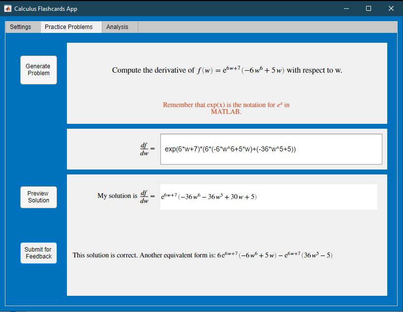

# Calculus \- Integrals

 or 

**Curriculum Module**

_Created with R2021b. Compatible with R2021b and later releases._

# Information

This curriculum module contains interactive [MATLAB® live scripts](https://www.mathworks.com/products/matlab/live-editor.html) that teach fundamental concepts and basic terminology related to integral calculus. There is a focus on numerical approximation and graphical representation as tools for understanding the concepts of integral calculus.

## Background

You can use these live scripts as [demonstrations](#H_9AAE657C) in lectures, class [activities](#H_EB6194F8), or interactive [assignments](#H_175C7D50) outside of class. Calculus \- Integrals covers [Riemann sum](#H_1F9663E8) approximations to definite integrals, indefinite integrals as [antiderivatives](#H_BA1C166C), and the [fundamental theorem of calculus](#H_A543F16F). It also covers the indefinite integrals of powers, exponentials, natural logarithms, sines, and cosines as well as [substitution](#H_A0468BE8) and [integration by parts](#H_D389B1B1). Applications include area and power. In addition to the[full scripts](#H_EB6194F8), [visualizations](#H_9AAE657C), and [practice scripts](#H_175C7D50) there is a [Calculus Flashcards app](#H_1F9459BC) included as well.

The instructions inside the live scripts will guide you through the exercises and activities. Get started with each live script by running it one section at a time. To stop running the script or a section midway (for example, when an animation is in progress), use the  Stop button in the **RUN** section of the **Live Editor** tab in the MATLAB Toolstrip.

Looking for more? Find an issue? Have a suggestion? Please contact the [MathWorks online teaching team](mailto:%20onlineteaching@mathworks.com).

## Contact Us

Solutions are available upon instructor request. Contact the [MathWorks teaching resources team](mailto:onlineteaching@mathworks.com) if you would like to request solutions, provide feedback, or if you have a question.

## Prerequisites

This module assumes a knowledge of functions that is standard in precalculus course materials regarding powers, exponentials, absolute values, logarithms, sines, cosines, rational functions, and asymptotes. It also assumes knowledge of basic area formulas, including the area of a trapezoid. With the exception of <samp>Riemann.mlx</samp> and <samp>RiemannViz.mlx</samp>, the scripts are written to follow [Calculus\-Derivatives](https://github.com/MathWorks-Teaching-Resources/Calculus-Derivatives) and expect basic understanding of derivatives and derivative rules. There is little expectation of familiarity with MATLAB, but you could use [MATLAB Onramp](https://matlabacademy.mathworks.com/details/matlab-onramp/gettingstarted) as another resource to acquire familiarity with MATLAB.

## Getting Started
### Accessing the Module
### **On MATLAB Online:**

Use the  link to download the module. You will be prompted to log in or create a MathWorks account. The project will be loaded, and you will see an app with several navigation options to get you started.

### **On Desktop:**

Download or clone this repository. Open MATLAB, navigate to the folder containing these scripts and double\-click on [Integrals.prj](https://matlab.mathworks.com/open/github/v1?repo=MathWorks-Teaching-Resources/Calculus-Integrals&project=Integrals.prj). It will add the appropriate files to your MATLAB path and open an app that asks you where you would like to start. 

Ensure you have all the required products ([listed below](#H_E850B4FF)) installed. If you need to include a product, add it using the Add\-On Explorer. To install an add\-on, go to the **Home** tab and select   **Add-Ons** > **Get Add-Ons**. 

## Products

MATLAB® is used throughout. Tools from the Symbolic Math Toolbox™ are used frequently as well.

# Scripts
| **Topic**    | **Full Script**    | **Visualizations**    | **Learning Goals**   In this script, students will...    | **Practice**     |
| :-- | :-- | :-- | :-- | :-- |
| [Antiderivatives](https://matlab.mathworks.com/open/github/v1?repo=MathWorks-Teaching-Resources/Calculus-Integrals&project=Integrals.prj&file=Scripts/Antiderivatives.mlx)    | [Antiderivatives.mlx](https://matlab.mathworks.com/open/github/v1?repo=MathWorks-Teaching-Resources/Calculus-Integrals&project=Integrals.prj&file=Scripts/Antiderivatives.mlx)       | [Visualizing Antiderivatives](https://matlab.mathworks.com/open/github/v1?repo=MathWorks-Teaching-Resources/Calculus-Integrals&project=Integrals.prj&file=Scripts/AntiderivativesViz.mlx)       |      see a graphical presentation of the concept of general antiderivatives.        develop computational fluency with the antiderivatives of powers, sines, cosines, and exponentials.    | [Calculate Antiderivatives](https://matlab.mathworks.com/open/github/v1?repo=MathWorks-Teaching-Resources/Calculus-Integrals&project=Integrals.prj&file=Scripts/AntiderivativesPractice.mlx)        |
| [Fundamental Theorem of Calculus](https://matlab.mathworks.com/open/github/v1?repo=MathWorks-Teaching-Resources/Calculus-Integrals&project=Integrals.prj&file=Scripts/FundamentalTheorem.mlx)    | [FundamentalTheorem.mlx](https://matlab.mathworks.com/open/github/v1?repo=MathWorks-Teaching-Resources/Calculus-Integrals&project=Integrals.prj&file=Scripts/FundamentalTheorem.mlx)       | [Visualizing the FTC](https://matlab.mathworks.com/open/github/v1?repo=MathWorks-Teaching-Resources/Calculus-Integrals&project=Integrals.prj&file=Scripts/FundamentalTheoremViz.mlx)       |      explain the fundamental theorem of calculus.        see why the Fundamental Theorem of Calculus makes sense graphically.        develop computational fluency for definite integrals involving linear and rational combinations of powers, sines, cosines, exponentials and natural logarithms.    | [Apply the Fundamental Theorem of Calculus](https://matlab.mathworks.com/open/github/v1?repo=MathWorks-Teaching-Resources/Calculus-Integrals&project=Integrals.prj&file=Scripts/FundamentalTheoremPractice.mlx)        |
| [Riemann Sums](https://matlab.mathworks.com/open/github/v1?repo=MathWorks-Teaching-Resources/Calculus-Integrals&project=Integrals.prj&file=Scripts/Riemann.mlx)    | [Riemann.mlx](https://matlab.mathworks.com/open/github/v1?repo=MathWorks-Teaching-Resources/Calculus-Integrals&project=Integrals.prj&file=Scripts/Riemann.mlx)       | [Visualizing Riemann Sums](https://matlab.mathworks.com/open/github/v1?repo=MathWorks-Teaching-Resources/Calculus-Integrals&project=Integrals.prj&file=Scripts/RiemannViz.mlx)       |      explain and apply the different approximations computed by a left\-endpoint, right\-endpoint, midpoint, maximum, or minimum method of selecting a height value in a Riemann sum.    |      explain and apply the trapezoidal approximation.        explain why increasing the number of intervals in an approximation will decrease the error.        discuss the implications for applying calculus in applications with values that are discrete or continuous.     |
| [Substitution](https://matlab.mathworks.com/open/github/v1?repo=MathWorks-Teaching-Resources/Calculus-Integrals&project=Integrals.prj&file=Scripts/Substitution.mlx)    | [Substitution.mlx](https://matlab.mathworks.com/open/github/v1?repo=MathWorks-Teaching-Resources/Calculus-Integrals&project=Integrals.prj&file=Scripts/Substitution.mlx)       | [Visualizing Substitution](https://matlab.mathworks.com/open/github/v1?repo=MathWorks-Teaching-Resources/Calculus-Integrals&project=Integrals.prj&file=Scripts/SubstitutionViz.mlx)       |      explain what the method of substitution is and how it works.        develop fluency with computing integrals of combinations of powers, sines, cosines, exponentials and logarithms that are solvable by substitution by hand.        see a graphical understanding of the method of substitution.    | [Apply the method of substitution](https://matlab.mathworks.com/open/github/v1?repo=MathWorks-Teaching-Resources/Calculus-Integrals&project=Integrals.prj&file=Scripts/SubstitutionPractice.mlx)        |
| [Integration by Parts](https://matlab.mathworks.com/open/github/v1?repo=MathWorks-Teaching-Resources/Calculus-Integrals&project=Integrals.prj&file=Scripts/ByParts.mlx)    | [ByParts.mlx](https://matlab.mathworks.com/open/github/v1?repo=MathWorks-Teaching-Resources/Calculus-Integrals&project=Integrals.prj&file=Scripts/ByParts.mlx)       | [Visualizing Integration by Parts](.Scripts/ByPartsViz.mlx)       |      explain what the method of integration by parts is and how it works.        develop fluency with computing integrals involving powers, sines, cosines, exponentials and logarithms that are solvable by integration by parts by hand.        see a graphical understanding of the integration by parts formula.    | [Apply the method of integration by parts](https://matlab.mathworks.com/open/github/v1?repo=MathWorks-Teaching-Resources/Calculus-Integrals&project=Integrals.prj&file=Scripts/ByPartsPractice.mlx)      &nbsp;&nbsp;&nbsp;&nbsp;&nbsp;&nbsp;&nbsp;&nbsp;&nbsp;&nbsp;&nbsp;&nbsp;&nbsp;&nbsp;&nbsp;&nbsp;&nbsp;&nbsp;      |

# [Calculus Flashcards App](https://matlab.mathworks.com/open/github/v1?repo=MathWorks-Teaching-Resources/Calculus-Integrals&project=Integrals.prj&file=Apps/CalculusFlashcards.mlapp")
| 1. Choose the type of practice.    | 2. Solve problems.    | 3. Analyze your progress.     |
| :-- | :-- | :-- |
|   |  |   |

# Setup To Use the Calculus Flashcards App

MATLAB Desktop

1.  Ensure that you have MATLAB R2021a or newer installed.
2. Download <samp>CalculusFlashcards.mlapp</samp> or download and unzip the entire repository.
3. Right\-click the app in MATLAB and select run or type <samp>run("CalculusFlashcards.mlapp")</samp> in the Command Window.

MATLAB Online

1.  

# License

The license for this module is available in the [LICENSE.md](https://github.com/MathWorks-Teaching-Resources/Calculus-Integrals/blob/release/LICENSE.md).

# Related Courseware Modules
| **Courseware Module**    | **Sample Content**    | **Available on:**     |
| :-- | :-- | :-- |
| [**Calculus: Derivatives**](https://www.mathworks.com/matlabcentral/fileexchange/99249-calculus-derivatives)     |     |       [GitHub](https://github.com/MathWorks-Teaching-Resources/Calculus-Derivatives)      |
|  [**Numerical Methods with Applications**](https://www.mathworks.com/matlabcentral/fileexchange/111490-numerical-methods-with-applications)    |     |       [GitHub](https://github.com/MathWorks-Teaching-Resources/Calculus-Derivatives)      |

Or feel free to explore our other [modular courseware content](https://www.mathworks.com/matlabcentral/fileexchange/?q=tag%3A%22courseware+module%22&sort=downloads_desc_30d).

# Educator Resources
-  [Educator Page](https://www.mathworks.com/academia/educators.html) 

# Contribute 

Looking for more? Find an issue? Have a suggestion? Please contact the [MathWorks teaching resources team](mailto:%20onlineteaching@mathworks.com). If you want to contribute directly to this project, you can find information about how to do so in the [CONTRIBUTING.md](https://github.com/MathWorks-Teaching-Resources/Calculus-Integrals/blob/release/CONTRIBUTING.md) page on GitHub.

 *©* Copyright 2023 The MathWorks™, Inc

